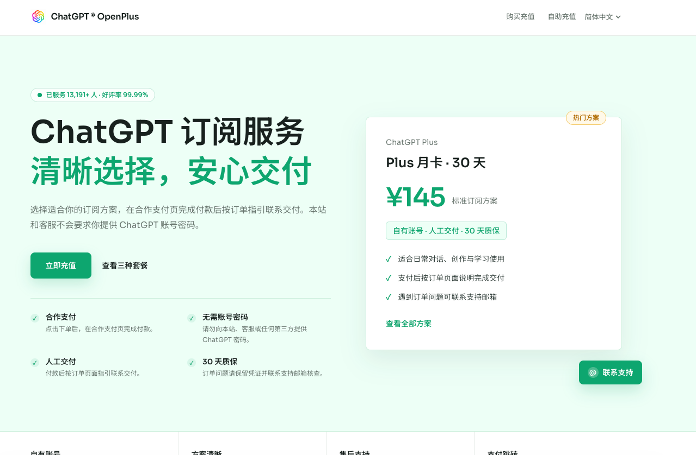
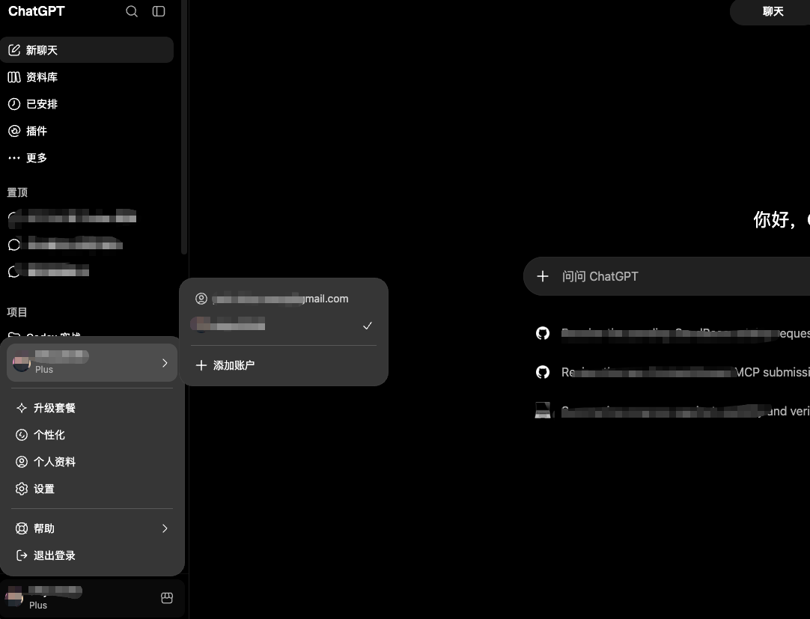

# 国内 ChatGPT Plus 怎么订阅？支付方式、代充服务与安全核验指南

> 本文持续维护，用于说明 ChatGPT Plus 的常见订阅路径和付款前核验要点。第三方服务并非 OpenAI 官方服务，套餐、价格、交付和售后规则请以服务方当前页面为准。

没有符合条件的国际支付方式时，国内用户订阅 ChatGPT Plus 往往会遇到付款困难。常见选择包括官方直接订阅、应用商店内购、礼品卡，以及第三方自助订阅服务。不同方式的操作门槛、账户掌控和售后边界都不相同。

如果只想先看结论：

- 有符合官方要求的支付方式，优先从 ChatGPT 账户内完成订阅；
- 熟悉 Apple 账户和商店规则时，可以评估官方 App 内购；
- 需要本地支付方式时，应先核验第三方服务的套餐、订单查询和售后条款；
- 不建议使用共享账号处理个人对话、代码、文档或其他隐私内容。

## 方法一：第三方自助订阅服务

### 适合谁？

这类服务适合没有稳定国际支付条件、不希望自行处理虚拟卡或应用商店地区、且愿意在付款前完整核验流程的用户。

第三方服务的交付方式可能不同。付款前应先查看套餐说明、适用范围、订单查询、退款规则和客服入口。不要把“能付款”理解成“没有风险”，更不要在流程不清楚时提交账户敏感信息。

这里提供一个可自行核验的服务入口：[ChatGPT OpenPlus](https://chatgptopenplus.com/)。建议先查看其当前套餐、付款说明和服务条款，再决定是否使用。

### 选择服务时看什么？

下单前建议逐项确认：

- 是否明确展示套餐价格、服务内容和交付方式；
- 是否支持订单查询，付款后能否保留订单凭证；
- 是否公开退款、失败订单和重复付款的处理规则；
- 是否提供可核验的客服或售后入口；
- 是否要求提供密码、短信验证码、API Key 或浏览器会话凭证；
- 是否说明已有订阅、账户地区或续费状态可能带来的限制。

这些条件不等于服务绝对没有风险，但能让付款、交付与售后的边界在下单前可见。若有人要求提供密码、验证码、恢复代码或 Session，请停止操作并重新核验。

### 优点

- 对没有国际支付方式的用户，操作路径相对集中；
- 可以在付款前核验套餐、订单和售后规则；
- 不必为了付款临时修改主力账户的地区设置；
- 用户可保留订单与付款凭证，用于后续查询。

### 注意事项

- 第三方服务不等同于 OpenAI 官方直付，价格和规则可能变化；
- 不要将密码、一次性验证码或会话凭证交给他人；
- 已有订阅时，先确认是否会影响剩余周期或续费；
- 数字化服务的退款限制通常较多，应先读清条款；
- 付款完成后，应回到自己的 ChatGPT 账户确认套餐状态。

## 方法二：官方直接订阅

如果你有符合官方要求的支付方式，直接在 ChatGPT 账户内订阅通常是账户管理最直接的路径。支付资料、地区信息和账户状态应符合官方规则；出现失败提示时，不建议连续尝试多张卡或频繁变更资料。

官方渠道的优点是续费、取消和账单一般都在同一账户体系内处理。缺点是它对支付条件有要求，并非所有用户都具备。

上图仅用于说明入口位置。实际菜单、套餐名称和可用选项会随账户与地区变化，请以自己的 ChatGPT 页面显示为准。

## 方法三：App Store 内购与礼品卡

苹果用户可自行了解官方 ChatGPT App 的应用内购买。这个路径由 Apple 账户管理，因此需要理解商店地区、礼品卡适用范围、税费和取消订阅的位置。

不要为了订阅仓促修改常用 Apple 账户的地区。已有余额、订阅或家庭共享可能受影响；礼品卡也应与账户地区匹配。

## 方法四：虚拟卡与共享账号

虚拟卡的支付成功率、费用、余额安全和后续续费都存在不确定性。若不熟悉国际支付规则，不应一次性存入大量余额，也不要因连续失败而反复尝试。

共享账号看起来便宜，但账户并不受自己掌控。聊天记录、上传文件和工作内容可能被其他使用者看到，也可能随时失效。涉及隐私或工作资料时，不建议使用。

## 四种方式怎么选？

| 方式 | 账户掌控 | 操作门槛 | 主要关注点 | 建议 |
| --- | --- | --- | --- | --- |
| 官方直接订阅 | 自己管理 | 取决于支付条件 | 支付资料与地区规则 | 有条件时优先考虑 |
| App Store 内购 | 自己管理 | 中等 | 商店地区、礼品卡、税费 | 熟悉苹果生态时评估 |
| 第三方自助服务 | 取决于具体流程 | 较低到中等 | 订单、售后、信息安全 | 下单前充分核验 |
| 共享账号 | 不掌控 | 低 | 隐私和稳定性 | 不建议用于正式使用 |

## 常见问题

### 没有海外信用卡，怎么订阅 ChatGPT Plus？

可以先评估应用商店内购或第三方自助服务。使用第三方服务前，应确认商品说明、订单查询、售后规则和敏感信息边界。可先查看 [ChatGPT OpenPlus](https://chatgptopenplus.com/) 的当前说明，再做决定。

### 需要把 ChatGPT 密码给客服吗？

不需要，也不应提供。密码、验证码、API Key 和会话凭证都可能让他人取得账户控制权。

### 已有 Plus 还能继续订阅吗？

先在账户内查看当前套餐的续费时间和规则。不同路径是否叠加、是否覆盖剩余周期，应以实际套餐和服务说明为准；不确定时不要提前付款。

### ChatGPT Plus 包含 API 额度吗？

ChatGPT 订阅和 API 计费通常是不同的产品与账单体系。购买前应以 OpenAI 当前的官方说明为准。

## 更多专题教程

- [ChatGPT Plus 怎么订阅：先做哪几步判断](docs/chatgpt-plus-guide.md)
- [付款方式怎么选：成本、流程与账户掌控](docs/payment-options.md)
- [账号安全清单：哪些信息绝不应交出去](docs/account-safety.md)
- [下单前核验清单：价格、交付与售后](docs/order-checklist.md)

## 总结

订阅服务真正需要看的不是某个宣传词，而是：账户是否由自己掌控、订单能否查询、售后规则是否公开、流程是否要求交出敏感信息。

有官方支付条件时优先考虑官方渠道；需要第三方服务时，先核验说明，再做决定。

**[ChatGPT Plus 订阅服务入口：ChatGPT OpenPlus](https://chatgptopenplus.com/)**
